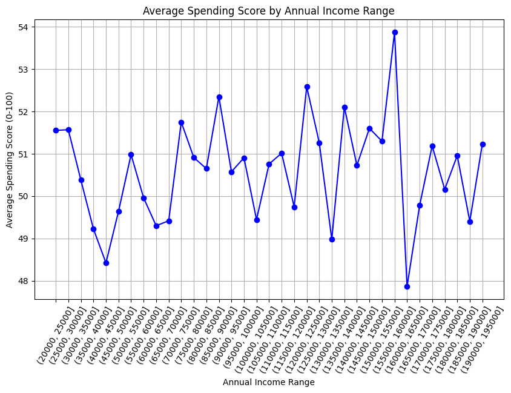

## Dataset
[Shopping Mall Customer Data Segmentation Data](https://www.kaggle.com/datasets/zubairmustafa/shopping-mall-customer-segmentation-data)

## Why did I chose this dataset?

I thought it was a fun dataset to work on, I like business and economics and I'd love to delve into trends and look into the data and try to visualize that data.

## Progress
- [x] Picked dataset
- [x] Defined 10 questions
- [x] Answered 10 questions using Pandas
- [x] Added at least one data visualization (using Matplotlib and/or Seaborn) to each single question
- [x] Prepared presentation slides to present at graduation

## Questions
- [X] Question 1: Find and visualize the average spending scores per age group.(Gen Z, Millenials, Gen X, Boomers etc.)
  - Answer: Gen Z: 51.84, Millenials: 50.22, Gen X: 50.74, Baby Boombers: 5.53, and the Silent Generation: 50.25 
  - Visualization: 

- [x] Question 2: Find and visualize what percent each age group makes up of mall shoppers.
  - Answer: Gen Z: 10.6%, Millenials: 22,1%, Gen X: 21.9% Baby Boombers: 25.7%, and the Silent Generation: 19.7% 
  - Visualization: 

- [x] Question 3: Find and visualize the gender makeup of the market and the gender split of each age segmentation.
  - Answer: Starting from now, any of the ones that get too long to list will only show the images
  - Visualization: 

- [x] Question 4: How are consumers segmented based on income according to the U.S Cencus Bureau's Income in the United States 2022 Report?
  - Answer: The highest demographic belongs to the Upper-Middle class, followed by Upper Class then from middle class down, it descends in order.
  - Visualization: 

- [x] Question 5: What is the distribution for Spending Score.
  - Answer: Spending Score from 0-25 made up 7.6%, the other 3 made up 30.8% each.
  - Visualization: 

- [x] Question 6: Of those in the top 25% of spending, how is it split based on gender and age?
  - Answer: Baby Boomers make the highest percent, followed by Millenials and Gen X, however, it should be noted that this is from 2022 and Gen Z is still relativlely small sample size since this data set only includes those over 18.
  - Visualization: 

- [x] Question 7: How would this visualization look if it was segmented by gender as well?
  - Answer: The distribution is 65% male and 35% female, it should also be noted that there aren't any women who are Boomers or Gen X with high spending score
  - Visualization: 

- [x] Question 8: How is income correlated with Spending Score?
  - Answer: Reaching this point was quite hard, at first I tried a scatter plot, but that was useless, since the dataset is so big, and going with each average for each income ammount was also useless, since there were so many unique incomes. So I split it up into chunks of 5000 dollars (I also tried 1000, 2000, and 300, but the labels ended up not having enough space).
  - Failed Attempt 
  - Visualization: 

- [x] Question 9: How is the group with 100 Spending score distributed based on gender and age?
  - Answer: Baby Boomer men and Millial men make up the biggest portion
  - Visualization: 

- [x] Question 10: How is the group with 100 Spending score distributed based on income?
  - Answer: The highest spenders have the income of 80k-120k and it's followed by 40k-80k.
  - Visualization: 